<div align="center">

# 🎬 Reel Automation

### An agentic engine that researches a topic like an analyst, then turns it into a faceless short-form video — grounded in real sources, not hallucinations.

[](https://github.com/MaanavA26/Reel_Automation/actions/workflows/ci.yml)
[](./LICENSE)
[](https://www.python.org/downloads/)
[](https://mypy-lang.org/)
[](https://docs.astral.sh/ruff/)
[](#testing--quality)

**Topic → Deep Research → Script → Voice + B-roll + Captions → Video → Publish → Learn.**

</div>

---

## Why this exists

Most "AI faceless video" tools are a thin wrapper around a single prompt: *"write me a 60-second script about X."* The result is confident, generic, and frequently **wrong** — and on platforms that pay for retention and punish misinformation, wrong content is worthless.

**Reel Automation is built the opposite way.** It treats every video as the output of a real research process: decompose the topic, gather and read multiple sources, extract claims *with citations*, **cross-check them across sources**, flag contradictions, have an **editorial critic** revise weak work, and only then write a script — carrying the caveats forward so the engine **never silently presents a disputed claim as settled fact.**

That single idea — *grounding and honesty enforced in code, not hoped for in a prompt* — is what makes the output good enough to build an audience on.

---

## The signature idea: evidence vs. inference, made *structural*

The hardest problem in research automation is the LLM confidently inventing facts, sources, or citations. Reel Automation makes that **structurally impossible** at every stage, using one repeated pattern:

> **The model authors only judgment (prose + a choice among things it was shown). Code attaches every id, validates every reference, and derives every structural fact.**

Concretely, across all five reasoning agents:

| The model may say… | …but **code** decides | Result |
|---|---|---|
| "these claims agree" | counts the **distinct sources** itself | "corroborated" requires ≥2 *real* sources, not the model's say-so |
| "cite evidence #2" | resolves the index against the **real evidence set** | a citation to evidence that doesn't exist is *unrepresentable* |
| "this finding is solid" | derives `disputed` / `weakest_support` from the cited verdicts | a finding can't overstate its own grounding |
| "the report looks great" | computes caveats over **all** findings | a contradiction can't be buried by simply not mentioning it |

The model proposes; the code disposes. Hallucinated provenance can't survive the type system.

---

## How it works

```mermaid
flowchart LR
    T([Topic]) --> P[plan]
    subgraph Research["🧠 Deep Research engine"]
      direction LR
      P --> A[acquire] --> I[ingest] --> E[extract] --> V[verify] --> S[synthesize] --> C[critique]
      C -. revise .-> S
      C --> R[report] --> K[packet]
    end
    K --> SC[script + shot-list]
    subgraph Media["🎥 Media production"]
      direction LR
      SC --> TTS[voiceover] --> SUB[captions] --> BR[B-roll] --> FF[ffmpeg compose]
    end
    FF --> SAFE{pre-publish<br/>safety gate}
    SAFE -->|clean| PUB[[publish: YouTube / TikTok / IG]]
    SAFE -->|disputed| HOLD[hold for review]
    PUB --> AN[analytics] -. what performed .-> TOPIC[topic / trend sourcing] -.-> T
```



The research half is organized into **four bands**, each a clean boundary:

- **🛰️ Research Control** — plan the topic into prioritized sub-questions; orchestrate the run.
- **📥 Knowledge Acquisition** — discover sources (web / PDF / YouTube), fetch + parse + chunk, extract grounded evidence.
- **🔬 Knowledge Reasoning** — cross-verify claims across sources, synthesize plan-anchored findings, run an editorial critic with a **bounded revision loop**.
- **📤 Research Publishing** — assemble a cited report and a creator packet (hooks, angles, narratives, key facts) for the video.

The production half turns that packet into a finished vertical video and ships it.

---

## Architecture in one breath

A disciplined separation that keeps the system honest and explainable:

- **Agents do judgment** — planning, verification, synthesis, critique, strategy. (LLM-backed, via a policy-driven model router.)
- **Tools do determinism** — fetching, parsing, chunking, claim-blocking, citation assembly, caveat derivation, ffmpeg composition, scheduling, publishing. (Pure, testable, no LLM.)
- **A typed state object** (`ResearchState`) threads through a **LangGraph** workflow; every node returns a partial update and the graph re-validates under a strict schema.
- **A provider-neutral model fabric** routes each *role* (planning / extraction / long-context / fallback) to a configured model — OpenAI-compatible, Gemini-native, or a registry of Groq / NVIDIA / HuggingFace / Ollama — with **caching, retry+fallback, and budget guardrails** layered as composable decorators.

Every non-trivial decision is captured as an **Architecture Decision Record** ([`docs/adrs/`](./docs/adrs/) — 40+ ADRs) and explained for an external audience in [`docs/showcase/`](./docs/showcase/).

---

## Highlights

- 🔎 **Deep Research, not RAG-lite** — multi-source discovery, cross-verification, contradiction detection, editorial revision loop.
- 🛡️ **Anti-hallucination by construction** — source-grounded citations and code-derived caveats that can't be dropped.
- 🧱 **Production-grade** — fully typed, strict-schema, 600+ hermetic tests, ADR-documented, CI-gated.
- 🔌 **Provider-agnostic** — swap LLM / search / TTS / visual / publishing providers by config; one OpenAI-compatible adapter serves many backends.
- 🎥 **End-to-end media** — TTS, deterministic SRT/VTT captions, stock B-roll retrieval, FFmpeg assembly, SEO metadata + thumbnails.
- 🤖 **Built to run unattended** — topic/trend sourcing → batch scheduler → safety gate → multi-platform publishing → analytics feedback loop.
- 💸 **Cost-aware** — per-run / per-day budget enforcement so an automated channel can't run up a surprise bill.

---

## Tech stack

| Layer | Choice |
|---|---|
| Orchestration | **LangGraph** state machine over a typed `ResearchState` |
| Backend | **FastAPI** + **Pydantic** (strict, `extra="forbid"`) |
| Models | Provider-neutral router → OpenAI-compatible / Gemini / Groq / NVIDIA / HF / Ollama |
| Media | **FFmpeg** composition, REST TTS, stock-video retrieval, stdlib SRT/VTT |
| Frontend | **React + Vite + TypeScript** studio dashboard |
| Quality | **ruff** (lint+format), **mypy** (strict), **pytest** (hermetic + `@integration` live), **gitleaks**, **actionlint**, **CodeQL** |
| Ship | Docker + Compose, GitHub Actions CI |

---

## Quickstart

```bash
# 1. Backend
cd backend
python3.11 -m venv .venv && source .venv/bin/activate
pip install -e .[dev]

# 2. Run the full gate suite (hermetic — no network, no keys)
make check          # ruff + ruff format + mypy + pytest   (from repo root)

# 3. Plan a research run against a real free LLM (set a provider in .env)
cp .env.example .env   # add an OpenAI-compatible base_url + key
python -m app.cli.plan "the economics of vertical farming"

# 4. Serve the API
uvicorn app.main:app --reload   # POST /api/v1/research  ·  GET /api/v1/health

# Frontend studio
cd ../frontend && npm install && npm run dev
```

> Full operator guide: [`docs/getting-started.md`](./docs/getting-started.md) · configuration reference: [`docs/configuration.md`](./docs/configuration.md) · the vision & path to revenue: [`docs/product-vision.md`](./docs/product-vision.md).

---

## Project status

This is an **actively-built, component-first system.** Honest snapshot:

| Area | State |
|---|---|
| Deep Research engine (plan → … → report → creator packet) | ✅ **Complete & tested** |
| Model fabric (multi-provider, cache, retry/fallback, budgets, eval) | ✅ Complete |
| Media production (TTS, captions, B-roll, ffmpeg, SEO, thumbnails) | ✅ Adapters built |
| Publishing (YouTube + TikTok/IG seams), scheduler, analytics, safety gate | ✅ Built |
| API + React studio + Python client | ✅ Built |
| **End-to-end live wiring** (config-selected providers → finished `.mp4` → posted) | 🔨 **In progress** |

The engine and every component exist and are tested hermetically; the remaining work is the **"last mile"** — wiring the live providers into the composition root and a single `topic → posted video` run with real keys + ffmpeg. The architecture is designed so that's configuration, not redesign.

---

## Repository layout

```text
backend/app/
  agents/        # judgment: planner, discovery, extraction, verification,
                 #           synthesis, editorial critic, report, creator packet
  services/      # determinism: llm fabric, search, ingestion, reasoning tools,
                 #              publishing, budget, jobs, eval
  media/         # tts · subtitles · visuals · composition · pipeline
  publishing/    # YouTube / TikTok / Instagram publishers
  scheduler/ · analytics/ · topics/ · channels/ · safety/   # the automation loop
  workflows/     # the LangGraph Deep Research graph
  api/ · core/ · schemas/ · client/
docs/adrs/       # 40+ Architecture Decision Records
docs/showcase/   # public engineering deep-dives
frontend/src/    # React + TS studio
```

---

## Testing & quality

Everything is **hermetic by default** — the full pipeline runs end-to-end against fake providers with no network and no credentials, so `pytest` is fast and deterministic. Live paths (real LLMs, search, ffmpeg, uploads) sit behind `@pytest.mark.integration` and are skipped unless configured.

```bash
make check                       # the exact CI gate suite
pytest -m integration            # opt into the live smoke tests
```

Design decisions are recorded as ADRs; architectural changes come with one. Read the [coding](./docs/standards/) and [testing](./docs/standards/) standards before contributing.

---

## Roadmap

- **Now:** end-to-end live wiring → first auto-produced, auto-published video.
- **Next:** richer B-roll/video generation, durable multi-worker job store, streaming progress.
- **Later:** analytics-driven topic selection, brand/style memory, and a **multi-tenant hosted SaaS** so other creators can run their own channels.

---

## License

Licensed under the Apache License, Version 2.0 — see [`LICENSE`](./LICENSE). Copyright 2026 Maanav Aryan.

<div align="center"><sub>Built component-by-component as a serious exploration of modern agentic architecture — and a real content engine.</sub></div>
