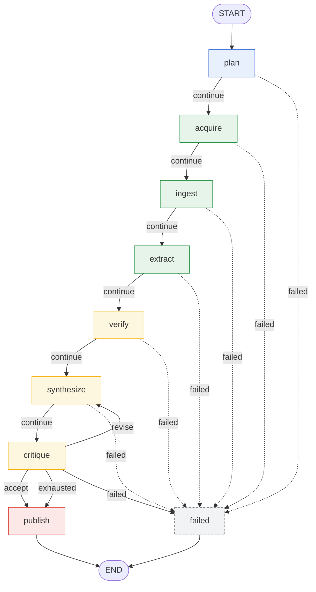

# Inside the Deep Research Engine

> A public engineering write-up of the **Deep Research** component of
> [Reel Automation](../../README.md) — the source-grounded, multi-agent research
> subsystem that turns a raw topic into verified, plan-anchored findings for
> downstream short-form video generation.
>
> This document describes the engine **as actually built** on the
> `feat/phase-0/revision-loop` branch (milestones M1–M10b). Where a capability is
> designed but not yet implemented, it is called out explicitly — accuracy is the
> point. Every claim links to the file or ADR that backs it.

---

## 1. Why this exists

Most "AI research" features are a search call wrapped around a summarization
prompt: the model is handed some text and asked to produce an answer, citations
and all. The model authors the *facts*, the *links*, and the *confidence* in one
breath. When it invents a URL or attributes a claim to the wrong source, nothing
in the system can tell.

Reel Automation's Deep Research engine is built on the opposite premise, stated
in the project's operating contract ([CLAUDE.md §11](../../CLAUDE.md)): a model
may author **judgment**, but it must never author **structural fact**. Source
URLs, evidence provenance, distinct-source counts, coverage gaps, accept/revise
decisions — anything that can be derived or validated by code — is owned by code.
The model proposes; the code decides and attaches.

That single discipline — *evidence-vs-inference made structural* — is the
engine's signature idea. Sections 4 and 5 walk through it in detail. First, the
shape of the system.

---

## 2. The four bands

The Deep Research engine is organized into four **bands** (CLAUDE.md §5.5), each
a stage in turning a topic into a publishable research artifact. Bands are a
conceptual grouping; the runtime is a single
[LangGraph](https://langchain-ai.github.io/langgraph/) `StateGraph` whose nodes
read and write one typed state object
([`ResearchState`](../../backend/app/schemas/research_state.py), ADR 0001).

| Band | Nodes (built) | Writes to state | Produces |
| --- | --- | --- | --- |
| **A. Research Control** | `plan` + the orchestration fabric | `plan`, `status`, `error`, `revision_iteration` | a `ResearchPlan` of prioritized `SubQuestion`s; lifecycle + failure routing |
| **B. Knowledge Acquisition** | `acquire`, `ingest`, `extract` | `acquisition.{sources,chunks,evidence}` | discovered `Source`s → `Chunk`s → source-grounded `Evidence` |
| **C. Knowledge Reasoning** | `verify`, `synthesize`, `critique` | `reasoning.{verdicts,synthesis,critiques}` | cross-checked `Verdict`s → plan-anchored `Finding`s → a quality `Critique` |
| **D. Research Publishing** | `publish` (stub) | `status` | terminal lifecycle marker today; report/creator-packet artifacts are M11–M12 |

### The band seam *is* the evidence-vs-inference seam

One mapping is worth pausing on because it differs from a naive reading of
CLAUDE.md §5.5, which lists "evidence extraction" under the Reasoning band.

In the implementation, **`extract` belongs to Acquisition, not Reasoning.** The
reason is principled, not arbitrary: `extract_node` writes
`state.acquisition.evidence`, and `Evidence` is *source-grounded fact* — a claim
that a specific chunk of a specific source literally states. The first node that
produces **inference** — a conclusion drawn *across* sources rather than read
*from* one — is `verify`, whose docstring opens with exactly this framing:

> "[Cross-Verification] opens the Knowledge Reasoning band — the first node that
> produces *inference* (`Verdict`) rather than source-grounded *fact*
> (`Evidence`)."
> — [`backend/app/agents/cross_verification.py`](../../backend/app/agents/cross_verification.py)

So the band boundary between Acquisition and Reasoning falls precisely on the
fact/inference line. That is the same boundary Section 5 is about — the engine's
structure and its core discipline are the same idea viewed at two zoom levels.

> Footnote on §5.5: CLAUDE.md groups extraction under Reasoning at the *prose*
> level; the code draws the band line one node later, on the fact-vs-inference
> seam. The substates (`acquisition.evidence` vs `reasoning.verdicts`) encode the
> implementation's view, and downstream bands can never conflate the two because
> they live in separate substates.

---

## 3. The node pipeline

The happy path is a linear chain through the four bands, with one cycle in the
Reasoning band (the revision loop) and a shared failure sink:

```
plan → acquire → ingest → extract → verify → synthesize → critique → publish
                                                  ↑______________│ (revise)
```

Node by node (all wired in
[`backend/app/workflows/deep_research.py`](../../backend/app/workflows/deep_research.py)):

| Node | Band | Kind | What it does |
| --- | --- | --- | --- |
| `plan` | Control | **Agent** | `ResearchPlannerAgent` decomposes the topic into prioritized, non-overlapping sub-questions (`PLANNING` role). |
| `acquire` | Acquisition | **Agent + Tool** | `SourceDiscoveryAgent` plans search queries (model) and retrieves `Source`s via an injected `SearchProvider` tool. |
| `ingest` | Acquisition | **Tool** | `IngestionService` fetches, parses, and chunks each web source — fully deterministic, no model. |
| `extract` | Acquisition | **Agent** | `EvidenceExtractionAgent` reads each chunk in isolation and extracts the claims it supports, each with a confidence (`EXTRACTION` role). |
| `verify` | Reasoning | **Agent + Tool** | `build_claim_blocks` (tool) clusters related claims; `CrossVerificationAgent` judges each cluster into a `Verdict` (`PLANNING` role). |
| `synthesize` | Reasoning | **Agent** | `SynthesisAgent` composes verdicts (+ sub-questions) into plan-anchored `Finding`s (`LONG_CONTEXT` role). |
| `critique` | Reasoning | **Agent + Tool** | `uncovered_sub_question_ids` (tool) computes coverage gaps; `EditorialCriticAgent` judges synthesis quality (`PLANNING` role). |
| `publish` | Publishing | **Stub** | Marks the job `COMPLETED`. Real report/export/creator-packet generation is M11–M12. |
| `failed` | Control | **Sink** | Terminal node for any node that raised; the failure `status`/`error` were already set before routing. |

A note on what is **not** yet running, so the diagram is read honestly:

- **Live search is not wired in.** `acquire` runs against a `FakeSearchProvider`;
  the real adapter is roadmap milestone **M-LP.2**. Ingestion is **web-only**
  today (PDF / YouTube / OCR are deferred — ADR 0008).
- **Every node is a single-channel write.** The fan-out reducers and per-item
  concurrency that would let extraction or verification run N branches in
  parallel are deliberately deferred to the checkpointer milestone (ADR 0002 §6).
  Today each node makes its calls and writes its channel once.
- **`publish` is a lifecycle stub.** It advances `status` to prove the
  state-threading contract; it produces no artifacts yet.

---

## 4. The LangGraph topology (with the revision cycle and failure sink)

This diagram reflects the exact edge wiring in `build_research_graph`. The six
linear bands each route on the job `status` (`continue` → next node, `failed` →
the sink). The `critique` node is the exception: it routes on the editorial
**decision** via a four-way router, including the back-edge that makes this the
graph's first cycle.



**How to read it against the code:**

- **`START → plan`** and **`publish → END`** are unconditional `add_edge` calls.
- The six **solid `continue` edges** and six **dashed `failed` edges** are the
  `bands` tuple in `build_research_graph`: each `add_conditional_edges(source,
  _route_on_status, {"continue": next, "failed": "failed"})`. `_route_on_status`
  returns `"failed"` iff `state.status is JobStatus.FAILED`, else `"continue"`.
- **`critique` has four outgoing edges**, from `_make_critique_router`:
  `revise → synthesize` (the back-edge / cycle), `accept → publish`,
  `exhausted → publish`, `failed → failed`.
- **`publish` has no `failed` edge.** It is the last band and routes
  unconditionally to `END` — a publish-time failure still ends the run with
  `status=FAILED` set, just without passing through the sink (ADR 0005 §Neutral).
  The diagram deliberately omits a `publish → failed` edge because the code has
  none.

### Why the loop always terminates

The cycle is bounded by the Research Control band, not by the model:

- The `critique` node is the **sole writer** of a top-level
  `revision_iteration` counter, incremented once per pass. It lives top-level
  (not on `reasoning`) so the `synthesize` node's rewrite of the `reasoning`
  channel on the back-edge can never re-zero it.
- `_make_critique_router` forces `"exhausted"` once
  `revision_iteration >= max_syntheses` **regardless of what the model decided**
  — the model can propose `REVISE` forever, but it cannot keep the loop alive.
- An exhausted run **completes** with its best-effort synthesis (it is *not* a
  failure — the "a thin result is still a valid result" principle applied to the
  loop). That the budget was exhausted is recoverable from
  `revision_iteration == max_syntheses` with the last critique still `REVISE`.
- An explicit `recursion_limit` on `ainvoke` backstops the cycle above its
  legitimate worst case. A hit raises an *uncatchable* `GraphRecursionError`, so
  the code cap must always fire first; the backstop only ever catches a guard
  *bug*, never normal operation (ADR 0012).

This is the project's "model proposes, code decides" rule applied to the
continue/stop axis: the critic agent proposes `ACCEPT`/`REVISE`; the *router*
owns termination.

---

## 5. The signature idea: evidence-vs-inference, made structural

CLAUDE.md §11 lists two anti-patterns explicitly: *"no provenance on research
outputs"* and *"no distinction between evidence and inference."* The engine does
not address these with prompt instructions ("please cite your sources
accurately"). It addresses them with **structure**: at every band that uses a
model, the model is given a DTO that *cannot express* a provenance claim, and the
code attaches or derives the structural facts from real objects.

### The before / after frame

| | **Industry default** | **This engine** |
| --- | --- | --- |
| Source links | Model emits `url`, `title` in its answer | Model emits a *query*; the search **tool** produces the `Source.url` |
| Evidence provenance | Model says "according to source X…" | Model emits `claim` + `confidence`; **code** attaches `source_id`/`chunk_id`/`chunk_text` from the real objects |
| Corroboration | Model labels a claim "well-supported" | Model proposes a level; **code** counts distinct sources and overrides |
| Grounding caveat | Model decides whether to mention it | **Code** derives `disputed` / `weakest_support`; model has no field to omit it |
| Accept / revise | Model decides the synthesis is "good enough" | **Code** derives the decision from coverage + raised issues |

The engine was *never written the bad way* — the "before" column is the industry
default it was designed to avoid. Each agent enforces the discipline a little
differently; here are the five concrete points, in pipeline order.

#### 5.1 Discovery — the model never authors a URL

[`SourceDiscoveryAgent`](../../backend/app/agents/source_discovery.py) asks the
model for `_DiscoveryQuery` objects: a `query` string and a `source_type`. There
is no `url` field on the model-output DTO. The agent runs each query through the
injected `SearchProvider` *tool*, and the **tool's** result — never the model —
becomes the `Source.url`. The system prompt even ends with *"do not invent URLs —
only propose search queries,"* but the guarantee is structural: the model
literally has no field to put a URL in.

#### 5.2 Extraction — provenance is code-attached, not model-asserted

[`EvidenceExtractionAgent`](../../backend/app/agents/evidence_extraction.py)
reads each chunk in isolation and emits `_ExtractedClaim` objects: a `claim` and
a `confidence` in `[0,1]`. Again, no provenance fields. The agent then constructs
each `Evidence` with `source_id`, `source_url`, `chunk_id`, and `chunk_text`
copied **from the real `Chunk` and `Source`** it just fed to the model:

```python
Evidence(
    claim=claim.claim,            # model-authored
    confidence=claim.confidence,  # model-authored
    source_id=source.id,          # code-attached from the real Source
    source_url=source.url,        # code-attached
    chunk_id=chunk.id,            # code-attached from the real Chunk
    chunk_text=chunk.text,        # code-attached
    extracted_via=extracted_via,  # code-attached provenance
)
```

A claim can never be misattributed to a source it did not come from, because the
model is never asked which source a claim came from — the code already knows.

#### 5.3 Verification — local indices, and a code-counted corroboration gate

[`CrossVerificationAgent`](../../backend/app/agents/cross_verification.py) makes
the §11 boundary structural **twice**:

1. **The model references evidence only by local index.** It is shown a small
   cluster of claims labelled `[0]`, `[1]`, … and returns `supporting` /
   `contradicting` index lists. `_resolve_ids` maps those indices back to real
   `Evidence` objects and **drops any out-of-range index** the model invented. A
   verdict that resolves to *no* supporting evidence is dropped entirely — a
   verdict must rest on at least one real evidence item.
2. **`CORROBORATED` requires ≥2 distinct sources, counted by code.**
   `_reconcile_support_level` computes
   `distinct_sources = {ev.source_id for ev in supporting}` and **downgrades to
   `SINGLE_SOURCE`** if the count is below two — no matter what the model
   labelled it. Intra-source repetition (the same source saying the same thing
   twice) can never masquerade as corroboration. `CONTRADICTED` is symmetrically
   gated: it is downgraded unless at least one *resolved* contradicting item
   exists.

The model does the semantic judgment (which claims are about the same fact);
code owns the countable structural fact (how many distinct sources back it).

#### 5.4 Synthesis — the grounding caveat the model cannot omit

[`SynthesisAgent`](../../backend/app/agents/synthesis.py) composes verdicts into
`Finding`s. The model authors prose and two sets of local indices — `V#` into the
verdict list, `S#` into the sub-question list — resolved against their own
separate lists (so a verdict index can never be misread as a sub-question). The
**keystone guard** is the grounding summary:

```python
disputed=any(v.support_level is SupportLevel.CONTRADICTED for v in supporting),
weakest_support=min(supporting, key=lambda v: _SUPPORT_RANK[v.support_level]).support_level,
```

Both are **code-derived from the cited verdicts**, and the model-output DTO has
*no field to report them*. A finding therefore cannot present a contradicted
verdict as settled, and the caveat travels forward to the report
**non-omittably**. A finding resting on a `CONTRADICTED` and a `CORROBORATED`
verdict floors to `CONTRADICTED` — the most cautious reading wins.

#### 5.5 Critique — the accept/revise decision is code's call

[`EditorialCriticAgent`](../../backend/app/agents/editorial_critic.py) is where
the discipline closes the loop. The split is sharp:

- **Coverage** (which sub-questions have zero findings) is a pure
  set-difference, owned by the
  [`uncovered_sub_question_ids`](../../backend/app/services/reasoning/coverage.py)
  **tool** — the model never computes it.
- The **agent** judges only what code cannot: redundancy, imbalance, unclear
  prose, and whether a finding's *wording* overstates past its code-attached
  `disputed`/`weakest_support` flags.
- The **decision is code-derived**:
  `REVISE iff (uncovered or issues) else ACCEPT`. The model gets no vote field, so
  it can never `ACCEPT` past an objective coverage gap, nor hallucinate or
  suppress one.

A subtle, deliberate consequence: a *disputed* finding is **not** a revise
trigger. A contradicted topic is a valid, already-surfaced outcome, and
re-synthesis cannot un-dispute it — only coverage gaps and quality issues trigger
a revision (ADR 0012). The engine distinguishes "the world is genuinely
contested" from "the synthesis is sloppy," and only loops on the latter.

### The pattern, in one sentence

> At every model-using band, the model authors **judgment** (claims, queries,
> prose, quality issues) by **local index or plain text**; code **resolves,
> validates, attaches, and derives** every **structural fact** (ids, URLs,
> distinct-source counts, disputed flags, coverage gaps, accept/revise
> decisions) from real objects — so the engine's structural guarantees never
> depend on the model behaving.

This is also why the **agent-vs-tool** boundary (CLAUDE.md §4) is so crisp here.
Deterministic, judgment-free work is a *tool* (`SearchProvider`,
`IngestionService`, `build_claim_blocks`, `uncovered_sub_question_ids`); work
requiring reasoning is an *agent* (planner, discovery, extraction, verification,
synthesis, critic). The two are never mixed in one module, and an agent that
needs deterministic work delegates to a tool rather than asking the model to fake
it.

---

## 6. Supporting architecture (briefly)

A few cross-cutting decisions make the above possible and are worth naming for a
reader evaluating the engineering:

- **Typed state, partial-update contract (ADR 0002).** Every node is
  `async def node(state: ResearchState) -> dict` returning only the channels it
  changed. This was chosen empirically — returning a full state crashes under
  fan-out — and it structurally eliminates the id/timestamp regeneration trap.
- **Model fabric / role routing (ADR 0003, §6).** Agents ask a `ModelRouter` for
  a *role* (`PLANNING`, `EXTRACTION`, `LONG_CONTEXT`), never a concrete model.
  Today several roles resolve to the same configured model — the seams to route
  per role by config are in place, but the engine is **not** running many
  different models; that is a configuration change, not a code change. One
  `OpenAICompatibleProvider` adapter (ADR 0007) serves any OpenAI-compatible
  backend (Groq, OpenRouter, Together, local Ollama).
- **Factory-closure dependency injection (ADR 0004).** Each node closes over its
  collaborator, bundled into a single frozen `ResearchDeps` container — so the
  graph is built per dependency-set and is trivially testable with fakes.
- **Deterministic failure path (ADR 0005).** `_with_failure_handling` converts
  any node exception into a `FAILED` state update *before* routing, because
  conditional edges only fire on a successful return. The §5.6 "Research
  Orchestrator Agent" is aspirational — M4 is deterministic, and retries /
  budgets / progress / `CANCELLED` are deferred to consumers that don't exist
  yet (ADR 0005 §Deferred).

---

## 7. What's next

The engine is complete through the Knowledge Reasoning band. The roadmap
([docs/ROADMAP.md](../ROADMAP.md)) sequences what remains:

- **M11 — Report + structured export.** Turn the `Synthesis` + `Critique` into a
  research report, an evidence map, and a contradiction/caveat list. The
  non-omittable `disputed`/`weakest_support` flags from Section 5.4 are exactly
  the inputs this band surfaces.
- **M12 — Creator packet + downstream handoff.** Hooks, content angles, key
  facts, narrative options, and explicit unsafe/unverified-claim warnings — the
  artifacts the Media Production layer consumes to build a video. This replaces
  the `publish` stub.
- **M-LP — Live provider adapters.** A real `SearchProvider` (M-LP.2) unblocks
  source discovery end-to-end; provider-SDK adapters (M-LP.3) are a fallback if
  free-model JSON reliability proves insufficient. The LLM adapter (M-LP.1) is
  already done — the Planner runs against a real free model today.
- **Beyond Deep Research — the Media Production layer.** TTS, subtitles,
  image/video generation, and FFmpeg-based composition (CLAUDE.md §3.3),
  consuming the M12 creator packet as its input contract.

Two known limits are worth stating plainly. The eventual revision loop can only
fix *synthesis-layer* defects (composition, overstated prose, an ignored
verdict); a coverage gap rooted in *missing evidence* needs a loop back to
`acquire`/`extract`, which reopens the fan-out accumulation problem and is gated
on the checkpointer milestone (ADR 0012). And fan-out concurrency itself — the
ability to extract and verify many items in parallel — is deferred until that
same milestone (ADR 0002 §6). Both are deliberate deferrals with named
consumers, not oversights.

---

## References

- Operating contract: [CLAUDE.md](../../CLAUDE.md) — §4 (agent vs tool), §5.5
  (the four bands), §11 (evidence vs inference), §12 (public showcase goal).
- Workflow: [`backend/app/workflows/deep_research.py`](../../backend/app/workflows/deep_research.py)
- Agents: [`backend/app/agents/`](../../backend/app/agents/)
- Tools/services: [`backend/app/services/`](../../backend/app/services/)
- Architecture decisions: [`docs/adrs/`](../adrs/) — 0001 (state/provenance),
  0002 (LangGraph contract), 0003 (model fabric), 0004 (DI), 0005 (error
  handling), 0006 (source discovery), 0007 (LLM adapter), 0008 (ingestion),
  0009 (extraction), 0010 (cross-verification), 0011 (synthesis), 0012 (critic +
  revision loop).
- Roadmap: [docs/ROADMAP.md](../ROADMAP.md)
